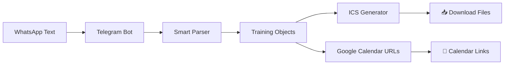

# 🏃‍♂️ Training Calendar Bot 🏊‍♀️

> **Transform your WhatsApp workout schedules into calendar events in seconds!** ⚡

[](https://www.python.org/)
[](https://core.telegram.org/bots/api)
[](https://railway.app)

## 🎯 What does it do?

Ever tired of manually adding workout sessions to your calendar? This bot takes your Russian training schedules from WhatsApp and magically converts them into:

- 📥 **ICS files** for any calendar app
- 📅 **Google Calendar links** for instant adding
- 🎨 **Beautiful formatting** with emojis and Russian dates

## ✨ Features

- 🤖 **Smart parsing** - understands Russian workout descriptions
- 🏃 **Multi-sport support** - Running, Swimming, Cycling, and combinations
- 📍 **Location tracking** - extracts venues and Waze links
- ⚡ **One-click calendar** - direct Google Calendar integration
- 🎛️ **Interactive selection** - choose which workouts to add
- 🌍 **Timezone aware** - calculates correct dates automatically

## 🚀 Demo

Send this to the bot:
```
🏃‍♀️ Воскресенье, бег: техника, сила, скорость, 19:30, Бат-Ям.
Точка сбора 👉🏻 https://waze.com/ul/hsv8wn6rz1 
🛟 Понедельник, плавание, 19:50 Кантри Рамат Ган.
🚴 Суббота, длительное вело, холмы, 6:00, заправка Делек, Рамле.
```

Get this magic ✨:


Then choose: **📥 Download .ics** or **📅 Google Calendar**

## 🛠️ Tech Stack

- **Python 3.12+** - Modern async/await
- **python-telegram-bot** - Telegram Bot API wrapper
- **Railway** - Cloud deployment platform
- **Regular Expressions** - Smart text parsing
- **ICS Format** - Universal calendar standard

## 🏗️ Architecture



## 🚀 Quick Start

### 1. Prerequisites
- Python 3.12+
- Telegram Bot Token from [@BotFather](https://t.me/botfather)

### 2. Installation
```bash
git clone https://github.com/yourusername/training-calendar-bot
cd training-calendar-bot
pip install -r requirements.txt
```

### 3. Environment Setup
```bash
export BOT_TOKEN="your_telegram_bot_token_here"
```

### 4. Run Locally
```bash
python main.py
```

### 5. Deploy to Railway
[](https://railway.app/template/training-calendar-bot)

1. Click the button above
2. Connect your GitHub repo
3. Add `BOT_TOKEN` environment variable
4. Deploy! 🚀

## 📝 Supported Formats

The bot understands various Russian workout formats:

| Input Example | Sport Detected | Features |
|---------------|----------------|----------|
| `🏃 Воскресенье, бег, 19:30, Бат-Ям` | Running | Basic parsing |
| `🏊 Понедельник, плавание, 20:00` | Swimming | Time extraction |
| `🚴 Суббота, вело, 6:00, Рамла` | Cycling | Location parsing |
| `🏃🏊 Пятница, бег + море, 6:00` | Run+Swim | Combination sports |

## 🔧 Configuration

### Environment Variables
| Variable | Description | Required |
|----------|-------------|----------|
| `BOT_TOKEN` | Telegram Bot API token | ✅ |
| `LOG_LEVEL` | Logging level (INFO, DEBUG) | ❌ |

### Workout Types
```python
WORKOUT_TYPES = {
    "бег": {"emoji": "🏃", "name": "Running"},
    "плавание": {"emoji": "🏊", "name": "Swimming"}, 
    "вело": {"emoji": "🚴", "name": "Cycling"},
}
```

## 🤝 Contributing

We love contributions! Here's how to get started:

1. **Fork** the repo
2. **Create** a feature branch (`git checkout -b feature/amazing-feature`)
3. **Commit** your changes (`git commit -m 'Add amazing feature'`)
4. **Push** to the branch (`git push origin feature/amazing-feature`)
5. **Open** a Pull Request

### Development Setup
```bash
# Install dev dependencies
pip install -r requirements-dev.txt

# Run tests
pytest

# Format code
black .
isort .

# Type checking
mypy main.py
```

## 🐛 Known Issues & Troubleshooting

| Issue | Solution |
|-------|----------|
| `Conflict: terminated by other getUpdates` | Only run one bot instance |
| Bot doesn't respond to buttons | Check handlers are added before `run_polling()` |
| Wrong timezone in calendar | Verify server timezone settings |
| Emoji parsing issues | Update regex patterns for new emoji |

## 📊 Usage Stats

- 🚀 **Processing time**: < 2 seconds per schedule
- 📱 **Mobile optimized**: Works great on phones
- 🌐 **Multi-language**: Russian text with English output
- 📅 **Calendar compatibility**: Works with Google, Apple, Outlook

## 🎨 Roadmap

- [ ] 🌍 Multi-language support (Hebrew, English)
- [ ] 📱 Web interface version
- [ ] 🔔 Reminder notifications
- [ ] 📊 Analytics dashboard
- [ ] 🎯 AI-powered workout suggestions
- [ ] 🏆 Integration with fitness trackers

## 📄 License

This project is licensed under the MIT License - see the [LICENSE](LICENSE) file for details.

## 🙏 Acknowledgments

- 🤖 [python-telegram-bot](https://github.com/python-telegram-bot/python-telegram-bot) - Awesome Telegram Bot framework
- 🚂 [Railway](https://railway.app) - Simple deployment platform
- 💪 All the fitness enthusiasts who inspired this project

## 📞 Support

- 🐛 **Bug reports**: [Open an issue](https://github.com/yourusername/training-calendar-bot/issues)
- 💡 **Feature requests**: [Discussions](https://github.com/yourusername/training-calendar-bot/discussions)
- 📧 **Direct contact**: [your-email@example.com](mailto:your-email@example.com)

---

<div align="center">

**Made with ❤️ for the fitness community**

[⭐ Star this repo](https://github.com/yourusername/training-calendar-bot) • [🍴 Fork it](https://github.com/yourusername/training-calendar-bot/fork) • [📱 Try the bot](https://t.me/your_bot_username)

</div>
